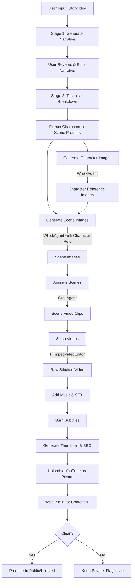

# AI Video Factory - Complete Project Documentation

> **Project Type:** Monorepo with Python Backend (FastAPI) + Next.js Frontend (Missing)  
> **Purpose:** Automated AI video production pipeline for YouTube content creation

---

## 📁 Project Structure

```
yt-automation/
├── apps/
│   ├── api/                    # Python FastAPI Backend (Main)
│   │   ├── main.py            # 1311 lines, 50+ endpoints
│   │   ├── Dockerfile
│   │   └── pyproject.toml
│   └── web/                    # ⚠️ EMPTY - Next.js Frontend Missing!
│
├── packages/
│   ├── services/               # Core Python Services (25+ modules)
│   ├── shared/                 # Shared Configuration
│   │   ├── config.py          # Pydantic schemas
│   │   └── channels.json      # Channel presets (pets, history, scifi)
│   └── database/
│       └── seed.ts            # Database seeder
│
├── prisma/
│   ├── schema.prisma          # 3 Models: Channel, Character, Video
│   └── migrations/
│
├── scripts/                    # Utility scripts
├── docs/
├── .env.example
├── docker-compose.yml          # Inngest container
├── turbo.json                  # TurboRepo config
├── requirements.txt
└── package.json
```

---

## 🗄️ Database Schema (Prisma + PostgreSQL)

```prisma
model Channel {
  id             String   @id @default(cuid())
  nicheId        String   @unique    // e.g., "pets", "history"
  name           String
  styleSuffix    String              // AI style prompt suffix
  voiceId        String              // Edge-TTS voice ID
  anchorImage    String?             // R2 key for anchor/character
  bgMusic        String?             // R2 key for background music
  youtubeId      String?
  defaultTags    String[]
  thumbnailStyle String?
  apiToken       String?             // YouTube OAuth token path
  videos         Video[]
  characters     Character[]
}

model Character {
  id        String   @id @default(cuid())
  channelId String
  channel   Channel  @relation(...)
  name      String
  imageUrl  String                   // R2 storage key
}

model Video {
  id         String   @id @default(cuid())
  channelId  String
  channel    Channel  @relation(...)
  title      String
  status     String                  // DRAFT, PROCESSING, UPLOADED
  script     Json                    // Full script data
  assets     Json?                   // Generated assets metadata
  youtubeUrl String?
  jobId      String?                 // Inngest job ID
}
```

---

## 🔧 Backend Services (`packages/services/`)

### AI Generation Services

| Module | Purpose | Technologies |
|--------|---------|--------------|
| `script_generator.py` | Generate video scripts from topics | Gemini 2.0 Flash, HuggingFace (Qwen) |
| `grok_agent.py` | Video animation from images | Playwright automation of Grok Imagine |
| `whisk_agent.py` | Image generation with character consistency | Playwright automation of Google Whisk |
| `ai_identity.py` | AI identity/persona management | - |
| `cloudflare_ai.py` | Cloudflare AI Workers integration | Cloudflare Workers AI |
| `fal_ai_image_generator.py` | Fal.ai image generation | Fal.ai API |
| `huggingface_image_generator.py` | HuggingFace image generation | HuggingFace Inference API |

### Video Production Services

| Module | Purpose | Technologies |
|--------|---------|--------------|
| `video_editor.py` | FFmpeg video editing (stitch, transitions, subtitles) | FFmpeg, ffmpeg-python |
| `video_workflow.py` | Inngest durable workflows for full pipeline | Inngest |
| `audio_engine.py` | TTS narration + sidechain compression | Edge-TTS, FFmpeg |
| `subtitle_engine.py` | Subtitle generation | - |
| `music_generator.py` | Background music generation/selection | - |
| `production.py` | Health checks, monitoring, logging | - |

### Cloud & Storage Services

| Module | Purpose | Technologies |
|--------|---------|--------------|
| `cloud_storage.py` | R2 file uploads/downloads, cleanup | Cloudflare R2 (S3-compatible), boto3 |
| `inngest_client.py` | Inngest client initialization | Inngest |

### YouTube Services

| Module | Purpose | Technologies |
|--------|---------|--------------|
| `youtube_uploader.py` | Upload with Private→Public workflow | YouTube Data API v3, Google OAuth |
| `youtube_seo.py` | Thumbnail, title, description, tags optimization | PIL, pattern-based generators |
| `mood_analyzer.py` | Content mood analysis | - |
| `quota_tracker.py` | YouTube API quota tracking | - |
| `usage_tracker.py` | Usage statistics | - |

---

## 🌐 API Endpoints Summary

### Health & Monitoring
| Method | Endpoint | Description |
|--------|----------|-------------|
| GET | `/health` | Basic health check |
| GET | `/health/full` | Full service health (DB, R2, APIs, Inngest) |
| GET | `/metrics` | Dashboard monitoring metrics |

### Storage Management
| Method | Endpoint | Description |
|--------|----------|-------------|
| GET | `/storage/stats` | R2 bucket usage stats |
| POST | `/storage/cleanup` | Trigger cleanup of old files |

### Channel Management
| Method | Endpoint | Description |
|--------|----------|-------------|
| GET | `/channels` | List all channels |
| GET | `/channels/{niche_id}` | Get channel config |
| POST | `/channels` | Create new channel |
| PUT | `/channels/{niche_id}` | Update channel |
| POST | `/channels/{niche_id}/upload` | Upload anchor image or music |

### Character Management
| Method | Endpoint | Description |
|--------|----------|-------------|
| GET | `/channels/{niche_id}/characters` | List characters |
| POST | `/channels/{niche_id}/characters` | Create character with image |
| DELETE | `/characters/{char_id}` | Delete character |
| POST | `/characters/generate-image` | AI-generate character image (Whisk) |

### Script Generation (2-Stage Process)
| Method | Endpoint | Description |
|--------|----------|-------------|
| POST | `/scripts/generate` | One-shot script generation |
| POST | `/scripts/generate-story` | Stage 1: Generate narrative |
| POST | `/scripts/generate-breakdown` | Stage 2: Create technical breakdown |

### Scene Generation
| Method | Endpoint | Description |
|--------|----------|-------------|
| POST | `/scenes/generate-image` | Single scene image (Whisk) |
| POST | `/scenes/generate-batch` | Bulk scene images (Whisk) |
| POST | `/scenes/generate-video` | Animate scene image (Grok) |

### Video Production
| Method | Endpoint | Description |
|--------|----------|-------------|
| POST | `/videos/stitch` | Stitch clips + add music |
| POST | `/videos` | Create video record |
| GET | `/videos` | List videos |
| POST | `/videos/submit` | Submit for full Inngest workflow |

---

## 🎬 Video Production Pipeline



---

## 🤖 AI Agents Deep Dive

### GrokAgent (`grok_agent.py`)
**Purpose:** Browser automation for X.com's Grok Imagine to animate images into video

**Key Features:**
- 5-Layer Prompt Formula (Scene + Camera + Style + Motion + Audio)
- Persistent browser profile authentication
- URL listener for post-generation navigation
- Duration/aspect ratio auto-configuration
- Stealth file upload with mouse jitter (anti-bot)
- Rate limit detection and handling

**Classes:**
- `PromptBuilder` - Formats motion prompts optimally
- `URLListener` - Captures new post URLs after generation
- `VideoSettings` - Configures duration (6s/10s) and aspect (9:16/16:9)
- `StealthUploader` - Human-like file upload behavior
- `GrokAnimator` - Main orchestrator class

### WhiskAgent (`whisk_agent.py`)
**Purpose:** Browser automation for Google Labs Whisk image generation

**Key Features:**
- Character consistency via reference uploads
- Style image support
- Aspect ratio switching (16:9 for landscape, 9:16 for shorts)
- Bulk batch generation mode
- Modal/dialog dismissal handling
- Session refresh for memory leak prevention

---

## 🔐 Environment Variables

```env
# Database
DATABASE_URL=postgresql://...

# Cloudflare R2 Storage
R2_ENDPOINT=https://...
R2_ACCESS_KEY_ID=...
R2_SECRET_ACCESS_KEY=...
R2_BUCKET=video-clips
R2_PUBLIC_URL=https://...  # Optional: For faster public URLs

# AI APIs
GEMINI_API_KEY=...
HUGGINGFACE_TOKEN=...

# YouTube OAuth
GOOGLE_CLIENT_SECRETS_PATH=./secrets/client_secrets.json

# Inngest (for durable workflows)
INNGEST_DEV_URL=http://localhost:8288
```

---

## 🚀 Running the Application

### Prerequisites
- Python 3.10+
- Node.js 18+
- FFmpeg (system installed)
- Docker Desktop (for Inngest)
- PostgreSQL database (Neon recommended)

### Setup Commands

```bash
# 1. Clone & Install
git clone https://github.com/asadmehboob174/yt-automation.git
cd yt-automation

# 2. Python Environment
python -m venv .venv
.\.venv\Scripts\Activate.ps1  # Windows
pip install -r requirements.txt
playwright install

# 3. Node Dependencies
npm install
npx prisma generate

# 4. Database
npx prisma migrate dev
npx tsx packages/database/seed.ts  # Optional seeding
```

### Running (3 Terminals)

```bash
# Terminal 1: Inngest
docker-compose up

# Terminal 2: Backend
$env:PYTHONPATH="."
python -m uvicorn apps.api.main:app --reload --port 8000

# Terminal 3: Frontend (⚠️ Currently Missing!)
cd apps/web
npm run dev
```

### First-Time Authentication

```bash
# Login to Grok (X.com account)
python auth_grok.py

# Login to Google Whisk
python auth_whisk_v2.py
```

---

## ⚠️ Known Issues & Missing Components

### Missing: Next.js Frontend (`apps/web/`)
The frontend was not committed to GitHub and is missing. It should contain:
- Dashboard UI for channel management
- Script editor with 2-stage workflow
- Character management interface
- Video preview and submission flow
- Job status monitoring

### Recommended Frontend Features to Rebuild:
1. **Dashboard** - Overview of channels, recent videos, job status
2. **Channel Manager** - Create/edit channels, upload assets
3. **Script Editor** - Multi-stage script generation workflow
4. **Character Manager** - Upload and manage character references
5. **Video Timeline** - Scene-by-scene editing with image/video preview
6. **Production Queue** - Submit videos and monitor Inngest jobs

---

## 📡 Default Channel Presets

| Channel | Style | Voice | Use Case |
|---------|-------|-------|----------|
| `pets` | Pixar 3D, soft lighting, cute | en-US-AriaNeural | Animal stories |
| `history` | Cinematic, epic, dramatic | en-US-GuyNeural | Historical documentaries |
| `scifi` | Cyberpunk, neon, futuristic | en-US-JennyNeural | Sci-fi content |

---

## 🔄 Video Workflow Types

### Story Mode
- Full animated stories with dialogue
- Grok generates video with baked-in character speech
- Background music added during final stitch

### Documentary Mode
- Narration-focused with visual b-roll
- Edge-TTS generates voiceover track
- Sidechain compression ducks music under speech

---

## 📊 Monitoring & Health

The `/health/full` endpoint checks:
- ✅ Database connectivity (Prisma)
- ✅ R2 storage access (boto3)
- ✅ HuggingFace API availability
- ✅ Gemini API availability
- ✅ Inngest dev server connectivity

---

## 📝 Key Files Reference

| File | Lines | Purpose |
|------|-------|---------|
| `apps/api/main.py` | 1311 | Main FastAPI application |
| `packages/services/grok_agent.py` | 1010 | Grok video animation |
| `packages/services/whisk_agent.py` | 856 | Whisk image generation |
| `packages/services/script_generator.py` | 890 | LLM script generation |
| `packages/services/video_workflow.py` | 659 | Inngest durable workflows |
| `packages/services/video_editor.py` | 547 | FFmpeg video processing |
| `packages/services/youtube_seo.py` | 567 | Thumbnail & SEO generation |
| `packages/services/cloud_storage.py` | 276 | R2 cloud storage |
| `packages/services/youtube_uploader.py` | 221 | YouTube upload workflow |
| `packages/services/audio_engine.py` | 155 | TTS & audio mixing |

---

## 🖥️ Frontend Implementation Plan

### Tech Stack
| Technology | Purpose |
|------------|---------|
| Next.js 15 | App Router framework |
| Tailwind CSS 4 | Styling |
| shadcn/ui | Clean, consistent UI components |
| Zustand | Workflow state persistence |
| React Query v5 | API state management |

### Sidebar Navigation
```
🎬 AI Video Factory
├── 🏠 Dashboard      ← Stats, recent projects
├── 📺 Channels       ← Channel CRUD
├── ➕ New Video      ← 5-step wizard
└── 📋 Script Queue   ← Scheduler table
```

### 5-Step Video Wizard

| Step | Name | Description |
|------|------|-------------|
| 1 | Script Input | Channel dropdown, Format (Short/Long), Type (Story/Documentary), AI/Manual tabs |
| 2 | Master Cast | Character cards with Generate + Lock/Unlock |
| 3 | Scene Images | Generate All + individual buttons (Whisk) |
| 4 | Scene Videos | Generate All + individual buttons (Grok) |
| 5 | Final Render | Music dropdown, stitch, preview, upload |

### 1-Click Automation Flow

When user clicks **"🚀 1-Click Automation"** on Manual Script tab:

```
┌────────────────────────────────────────────────────────────────┐
│ 1-Click Automation Progress                              [X]  │
├────────────────────────────────────────────────────────────────┤
│ ▓▓▓▓▓▓▓▓▓▓▓▓▓▓▓░░░░░░░░░░░░░░░░░░  35%                       │
│                                                                │
│ ✅ Step 1: Parsing script...                    Done           │
│ ✅ Step 2: Extracting characters...             Done           │
│ 🔄 Step 3: Generating character images (2/4)    In Progress    │
│ ⏳ Step 4: Generating scene images (0/12)       Pending        │
│ ⏳ Step 5: Generating scene videos (0/12)       Pending        │
│ ⏳ Step 6: Stitching final video                Pending        │
│                                                                │
│ Current: Generating WHISKERS image via Whisk...                │
│ [Cancel Automation]                                            │
└────────────────────────────────────────────────────────────────┘
```

**Automation Sequence:**
1. Parse script via `/scripts/generate-breakdown`
2. Extract characters from response
3. Generate character images (sequential via `/characters/generate-image`)
4. Generate scene images (batch via `/scenes/generate-batch`)
5. Generate scene videos (sequential via `/scenes/generate-video`)
6. Stitch final video via `/videos/stitch`
7. Send email notification on completion or error

### Queue Scheduler (Idle-Based)

**Conditions for auto-processing:**
- User idle for **15+ minutes** (no mouse/keyboard activity)
- No manual or 1-click automation currently running
- Queue has pending scripts

**Scheduler Status UI:**
```
┌─────────────────────────────────────────────────┐
│ Scheduler Status                                │
│ ● Ready - Processing queue (idle for 15 min)   │
│ ○ Paused - Automation in progress               │
│ ○ Waiting - User active                         │
└─────────────────────────────────────────────────┘
```

### Email Notifications

Sends email when video completes or errors occur.

**Environment Variables:**
```env
SMTP_SERVER=smtp.gmail.com
SMTP_PORT=587
SMTP_USER=your-email@gmail.com
SMTP_PASS=your-app-password
NOTIFICATION_EMAIL=your-email@gmail.com
```

### Multi-Platform Upload

| Platform | Status | Notes |
|----------|--------|-------|
| YouTube | ✅ Ready | OAuth configured |
| Instagram | ⏳ Placeholder | Requires Business Account |
| TikTok | ⏳ Placeholder | Requires Developer Account |
| Facebook | ⏳ Placeholder | Requires Developer App |

**Upload UI:**
```
☑️ YouTube     [Configured ✓]    [Upload]
☐ Instagram   [Not configured]  [Upload] Disabled
☐ TikTok      [Not configured]  [Upload] Disabled
☐ Facebook    [Not configured]  [Upload] Disabled
```

### Implementation Phases

| Phase | Duration | Tasks |
|-------|----------|-------|
| 1. Setup | 1 day | Next.js + shadcn/ui + folder structure |
| 2. Layout | 1 day | Sidebar, theme, base layout |
| 3. Channels | 1 day | CRUD pages + forms |
| 4. Wizard | 3 days | All 5 steps + 1-click automation |
| 5. Queue | 1 day | Table + scheduler + idle detection |
| 6. Polish | 1 day | Email, error handling, testing |

---

*Generated: February 2026*
