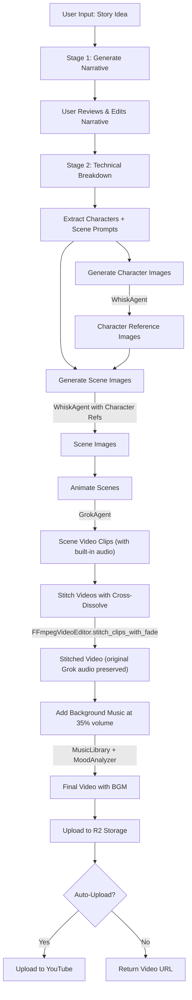

# AI Video Factory - Complete Project Documentation

> **Project Type:** Monorepo with Python Backend (FastAPI) + Next.js Frontend  
> **Purpose:** Automated AI video production pipeline for YouTube content creation  
> **Last Updated:** March 2026

---

## 📁 Project Structure

```
yt-automation/
├── apps/
│   ├── api/                    # Python FastAPI Backend (Main)
│   │   ├── main.py            # ~2716 lines, 70+ endpoints
│   │   ├── Dockerfile
│   │   └── pyproject.toml
│   └── web/                    # Next.js Frontend
│
├── packages/
│   ├── services/               # Core Python Services (25+ modules)
│   ├── shared/                 # Shared Configuration
│   │   ├── config.py          # Pydantic schemas
│   │   └── channels.json      # Channel presets (pets, history, scifi)
│   └── database/
│       └── seed.ts            # Database seeder
│
├── prisma/
│   ├── schema.prisma          # Models: Channel, Character, Video, BackgroundMusic
│   └── migrations/
│
├── scripts/                    # Utility scripts
├── docs/
├── .env.example
├── docker-compose.yml          # Inngest container
├── turbo.json                  # TurboRepo config
├── requirements.txt
└── package.json
```

---

## 🗄️ Database Schema (Prisma + PostgreSQL)

```prisma
model Channel {
  id             String   @id @default(cuid())
  nicheId        String   @unique    // e.g., "pets", "history"
  name           String
  styleSuffix    String              // AI style prompt suffix
  voiceId        String              // Edge-TTS voice ID (reserved for future use)
  anchorImage    String?             // R2 key for anchor/character
  bgMusic        String?             // R2 key for background music
  youtubeId      String?
  defaultTags    String[]
  thumbnailStyle String?
  apiToken       String?             // YouTube OAuth token path
  videos         Video[]
  characters     Character[]
}

model Character {
  id        String   @id @default(cuid())
  channelId String
  channel   Channel  @relation(...)
  name      String
  imageUrl  String                   // R2 storage key
}

model Video {
  id         String   @id @default(cuid())
  channelId  String
  channel    Channel  @relation(...)
  title      String
  status     String                  // DRAFT, PROCESSING, UPLOADED
  script     Json                    // Full script data
  assets     Json?                   // Generated assets metadata
  youtubeUrl String?
  jobId      String?                 // Inngest job ID
}

model BackgroundMusic {
  id        String   @id @default(cuid())
  name      String
  url       String                   // Direct URL to music file
  category  String                   // e.g., "epic", "calm", "dark"
}
```

---

## 🔧 Backend Services (`packages/services/`)

### AI Generation Services

| Module | Purpose | Technologies |
|--------|---------|--------------|
| `script_generator.py` | Generate video scripts from topics | Gemini 2.0 Flash, HuggingFace (Qwen) |
| `grok_agent.py` | Video animation from images (with built-in audio) | Playwright automation of Grok Imagine |
| `whisk_agent.py` | Image generation with character consistency | Playwright automation of Google Whisk |
| `ai_identity.py` | AI identity/persona management | - |
| `cloudflare_ai.py` | Cloudflare AI Workers integration | Cloudflare Workers AI |
| `fal_ai_image_generator.py` | Fal.ai image generation | Fal.ai API |
| `huggingface_image_generator.py` | HuggingFace image generation | HuggingFace Inference API |

### Video Production Services

| Module | Purpose | Technologies |
|--------|---------|--------------|
| `video_editor.py` | FFmpeg video editing (stitch, transitions, audio mixing) | FFmpeg, ffmpeg-python |
| `video_workflow.py` | Inngest durable workflows for full pipeline | Inngest |
| `audio_engine.py` | TTS narration engine (⚠️ **currently disabled**) | Edge-TTS, ElevenLabs, XTTS |
| `subtitle_engine.py` | Subtitle generation | - |
| `music_generator.py` | Background music selection/download from royalty-free library | incompetech.com |
| `mood_analyzer.py` | Content mood analysis for auto-selecting background music | - |
| `production.py` | Health checks, monitoring, logging | - |

### Cloud & Storage Services

| Module | Purpose | Technologies |
|--------|---------|--------------|
| `cloud_storage.py` | R2 file uploads/downloads, cleanup | Cloudflare R2 (S3-compatible), boto3 |
| `inngest_client.py` | Inngest client initialization | Inngest |
| `email_service.py` | Email notifications on completion/error | SMTP |

### YouTube Services

| Module | Purpose | Technologies |
|--------|---------|--------------|
| `youtube_uploader.py` | Upload with Private→Public workflow | YouTube Data API v3, Google OAuth |
| `youtube_seo.py` | Thumbnail, title, description, tags optimization | PIL, pattern-based generators |
| `mood_analyzer.py` | Content mood analysis | - |
| `quota_tracker.py` | YouTube API quota tracking | - |
| `usage_tracker.py` | Usage statistics | - |

---

## 🌐 API Endpoints Summary

### Health & Monitoring
| Method | Endpoint | Description |
|--------|----------|-------------|
| GET | `/health` | Basic health check |
| GET | `/health/full` | Full service health (DB, R2, APIs, Inngest) |
| GET | `/metrics` | Dashboard monitoring metrics |

### Storage Management
| Method | Endpoint | Description |
|--------|----------|-------------|
| GET | `/storage/stats` | R2 bucket usage stats |
| POST | `/storage/cleanup` | Trigger cleanup of old files |

### Channel Management
| Method | Endpoint | Description |
|--------|----------|-------------|
| GET | `/channels` | List all channels |
| GET | `/channels/{niche_id}` | Get channel config |
| POST | `/channels` | Create new channel |
| PUT | `/channels/{niche_id}` | Update channel |
| POST | `/channels/{niche_id}/upload` | Upload anchor image or music |

### Character Management
| Method | Endpoint | Description |
|--------|----------|-------------|
| GET | `/channels/{niche_id}/characters` | List characters |
| POST | `/channels/{niche_id}/characters` | Create character with image |
| DELETE | `/characters/{char_id}` | Delete character |
| POST | `/characters/generate-image` | AI-generate character image (Whisk) |
| POST | `/characters/generate-images-stream` | Batch character images (streaming) |

### Script Generation (2-Stage Process)
| Method | Endpoint | Description |
|--------|----------|-------------|
| POST | `/scripts/generate` | One-shot script generation |
| POST | `/scripts/generate-story` | Stage 1: Generate narrative |
| POST | `/scripts/generate-breakdown` | Stage 2: Create technical breakdown |
| POST | `/scripts/analyze-mood` | Stage 3: Analyze mood for music |

### Scene Generation
| Method | Endpoint | Description |
|--------|----------|-------------|
| POST | `/scenes/generate-image` | Single scene image (Whisk) |
| POST | `/scenes/generate-batch` | Bulk scene images (Whisk) |
| POST | `/scenes/generate-images-stream` | Batch scene images with streaming |
| POST | `/scenes/generate-video` | Animate scene image (Grok) |
| POST | `/videos/verify` | Verify video integrity on R2 |

### Video Production
| Method | Endpoint | Description |
|--------|----------|-------------|
| POST | `/videos/stitch` | Stitch clips + add background music |
| POST | `/videos` | Create video record |
| GET | `/videos` | List videos |
| POST | `/videos/submit` | Submit for full Inngest workflow |
| GET | `/audio/background-music` | List available background music tracks |

### Tools
| Method | Endpoint | Description |
|--------|----------|-------------|
| POST | `/tools/swap-audio` | Swap audio between two videos |

### Notifications
| Method | Endpoint | Description |
|--------|----------|-------------|
| POST | `/notifications/email` | Send email notification |
| GET | `/notifications/status` | Check email configuration |

---

## 🎬 Video Production Pipeline

### Current Active Workflow


```mermaid
graph TD
    A[User Input: Story Idea] --> B[Stage 1: Generate Narrative]
    B --> C[User Reviews & Edits Narrative]
    C --> D[Stage 2: Technical Breakdown]
    D --> E[Extract Characters + Scene Prompts]
    
    E --> F[Generate Character Images]
    F -->|WhiskAgent| G[Character Reference Images]
    
    E --> H[Generate Scene Images]
    G --> H
    H -->|WhiskAgent with Character Refs| I[Scene Images]
    
    I --> J[Animate Scenes]
    J -->|GrokAgent| K["Scene Video Clips (with built-in audio)"]
    
    K --> L[Stitch Videos with Cross-Dissolve]
    L -->|FFmpegVideoEditor.stitch_clips_with_fade| M["Stitched Video (original Grok audio preserved)"]
    
    M --> N[Add Background Music at 35% volume]
    N -->|MusicLibrary + MoodAnalyzer| O[Final Video with BGM]
    
    O --> P[Upload to R2 Storage]
    P --> Q{Auto-Upload?}
    Q -->|Yes| R[Upload to YouTube]
    Q -->|No| S[Return Video URL]
```

### Audio Flow (Current)

> **⚠️ IMPORTANT:** The project currently uses **Grok's built-in audio** for all video content. TTS/voiceover generation code exists but is **disabled**.

```
1. Grok generates video clips with BUILT-IN audio:
   - Dialogue is baked into the video by Grok via the 5-Layer Prompt Formula
   - SFX (sound effects) are generated by Grok based on the prompt
   - This is the ONLY audio source for speech/dialogue

2. During stitch (FFmpegVideoEditor.stitch_clips_with_fade):
   - Original Grok audio is PRESERVED from each clip
   - Audio streams are cross-faded between clips (acrossfade)
   - Whoosh SFX is optionally mixed at transitions (8% volume)

3. Background music is added AFTER stitching:
   - MoodAnalyzer determines music mood from script content
   - MusicLibrary downloads royalty-free track (incompetech.com)
   - Music is mixed at 35% volume via add_background_music()
   - Original Grok audio remains at full volume
```

### Disabled Features (Code Exists but Not Active)

| Feature | Location | How Disabled | Notes |
|---------|----------|------------|-------|
| **TTS Voiceover (per-scene)** | `main.py:1609` | `if False and ...` guard | Edge-TTS, ElevenLabs, XTTS providers available |
| **TTS Voiceover (full video)** | `main.py:1971` | `audio_provider = None` | Would generate narration from full script |
| **Smart Vocal Removal** | `main.py:1965` | Commented out entirely | Used Demucs for vocal separation |
| **4K Upscale (per-scene)** | `main.py:1590` | Commented out block | FFmpeg-based upscaling |
| **4K Upscale (stitch)** | `main.py:2028` | Active only for `480p` resolution | Upscales after stitching |
| **Voice Cloning** | `main.py:1484-1505` | Active code but unreachable (TTS disabled) | Downloads voice sample for XTTS |

---

## 🤖 AI Agents Deep Dive

### GrokAgent (`grok_agent.py`)
**Purpose:** Browser automation for X.com's Grok Imagine to animate images into video **with built-in audio**

**Key Features:**
- 5-Layer Prompt Formula (Scene + Camera + Style + Motion + Audio/Dialogue)
- Audio is baked into the video by Grok (dialogue, SFX, music cues)
- Persistent browser profile authentication
- URL listener for post-generation navigation
- Duration/aspect ratio/resolution auto-configuration
- Stealth file upload with mouse jitter (anti-bot)
- Rate limit detection and handling
- Moderation detection with auto-prompt-rewriting safety system

**Classes:**
- `PromptBuilder` - Formats motion prompts with Director's Script format: `[Timeline Actions] + AUDIO: [Character] (Tone): "Text" + SFX: [Effects]`
- `URLListener` - Captures new post URLs after generation
- `VideoSettings` - Configures duration (6s/10s), aspect (9:16/16:9), and resolution (720p)
- `StealthUploader` - Human-like file upload behavior
- `BrowserProfileManager` - Manages persistent browser profiles with cache/backup
- `GrokAnimator` - Main orchestrator class with `animate()` and `animate_batch()` APIs

### WhiskAgent (`whisk_agent.py`)
**Purpose:** Browser automation for Google Labs Whisk image generation

**Key Features:**
- Character consistency via reference uploads
- Style image support
- Aspect ratio switching (16:9 for landscape, 9:16 for shorts)
- Bulk batch generation mode
- Modal/dialog dismissal handling
- Session refresh for memory leak prevention

### ScriptGenerator (`script_generator.py`)
**Purpose:** Generate structured video scripts from story ideas

**Key Features:**
- 2-Stage process: Narrative → Technical Breakdown
- Gemini 2.0 Flash as primary LLM
- HuggingFace (Qwen) as fallback
- Regex-based fallback parser for structured extraction
- Prompt rewriting for moderation avoidance
- Outputs: scenes with `voiceover_text`, `dialogue`, `character_pose_prompt`, `motion_description`, `camera_angle`, `sfx_markers`

---

## 🎵 Background Music System

### Music Selection Priority

1. **Direct Music ID** — Frontend selects from curated `BackgroundMusic` database table
2. **Explicit User Selection** — User picks a mood manually (e.g., "epic", "calm")
3. **Auto-Analyze** — `MoodAnalyzer` uses LLM to analyze script/title and determine mood
4. **Channel Config Fallback** — Uses `bgMusic` from channel configuration
5. **None** — User can explicitly disable music (`music: "none"`)

### Available Moods (`MusicLibrary.TRACKS`)

| Category | Moods |
|----------|-------|
| Cinematic/Epic | `epic`, `dark`, `dramatic` |
| Happy/Upbeat | `happy`, `cheerful`, `celebration` |
| Calm/Ambient | `calm`, `peaceful`, `dreamy` |
| Tense/Suspense | `suspense`, `tension`, `mystery` |
| Cute/Playful | `cute`, `cute_lemon`, `kiki_jazz` |
| Sad/Emotional | `sad`, `emotional`, `cinematic_sad` |
| Action | `action`, `battle` |
| Nature | `nature`, `forest` |

### Music Processing
- Tracks are downloaded from incompetech.com (royalty-free)
- Cached locally in `packages/services/assets/music/`
- Looped/trimmed to match exact video duration
- Mixed at 35% volume with original video audio preserved

---

## 🔐 Environment Variables

```env
# Database
DATABASE_URL=postgresql://...

# Cloudflare R2 Storage
R2_ENDPOINT=https://...
R2_ACCESS_KEY_ID=...
R2_SECRET_ACCESS_KEY=...
R2_BUCKET=video-clips
R2_PUBLIC_URL=https://...  # Optional: For faster public URLs

# AI APIs
GEMINI_API_KEY=...
HUGGINGFACE_TOKEN=...

# YouTube OAuth
GOOGLE_CLIENT_SECRETS_PATH=./secrets/client_secrets.json

# Inngest (for durable workflows)
INNGEST_DEV_URL=http://localhost:8288

# FFmpeg (optional custom paths)
FFMPEG_PATH=ffmpeg
FFPROBE_PATH=ffprobe

# Email Notifications
SMTP_SERVER=smtp.gmail.com
SMTP_PORT=587
SMTP_USER=your-email@gmail.com
SMTP_PASS=your-app-password
NOTIFICATION_EMAIL=your-email@gmail.com
```

---

## 🚀 Running the Application

### Prerequisites
- Python 3.10+
- Node.js 18+
- FFmpeg (system installed)
- Docker Desktop (for Inngest)
- PostgreSQL database (Neon recommended)

### Setup Commands

```bash
# 1. Clone & Install
git clone https://github.com/asadmehboob174/yt-automation.git
cd yt-automation

# 2. Python Environment
python -m venv .venv
.\.venv\Scripts\Activate.ps1  # Windows
pip install -r requirements.txt
playwright install

# 3. Node Dependencies
npm install
npx prisma generate

# 4. Database
npx prisma migrate dev
npx tsx packages/database/seed.ts  # Optional seeding
```

### Running (3 Terminals)

```bash
# Terminal 1: Inngest
docker-compose up

# Terminal 2: Backend
$env:PYTHONPATH="."
python -m uvicorn apps.api.main:app --reload --port 8000

# Terminal 3: Frontend
cd apps/web
npm run dev
```

### First-Time Authentication

```bash
# Login to Grok (X.com account)
python auth_grok.py

# Login to Google Whisk
python auth_whisk_v2.py
```

---

## 📊 Video Stitch Endpoint Deep Dive (`/videos/stitch`)

This is the main endpoint that assembles the final video. Here's the complete flow:

```
1. Download all scene video clips from R2 (direct download or HTTP fallback)
2. Validate each clip:
   - HTML content check (catches Grok error pages)
   - File size check (>50KB)
   - FFprobe validation
3. Stitch valid clips:
   - stitch_clips_with_fade() with 0.3s cross-dissolve transitions
   - Audio crossfaded between clips
   - Optional whoosh SFX at 8% volume on transitions
   - Target resolution from channel config (1920x1080 or 1080x1920)
4. Optional: Color grading (if final_assembly.color_grading provided)
5. Generate background music:
   - Priority: music_id → manual selection → auto-mood → channel config → none
   - MoodAnalyzer picks mood from script/title
   - MusicLibrary downloads and loops/trims track to video duration
6. Mix audio:
   - Original Grok audio preserved at full volume
   - Background music mixed at 35% volume
7. Upload final video to R2
8. Optional: Auto-upload to YouTube
9. Return video URL + corrupt clip info
```

---

## ⚠️ Known Issues & Notes

### Audio Engine (Disabled)
The `audio_engine.py` module has full TTS capabilities:
- **Edge-TTS**: Microsoft's free cloud TTS (default)
- **ElevenLabs**: Premium voice synthesis API
- **XTTS**: Free voice cloning via HuggingFace Spaces (Coqui)
- **Sidechain Compression**: Auto-ducks music under narration
- **Vocal Removal**: Demucs-based vocal separation

These are currently disabled in favor of Grok's built-in audio. The code is preserved for future use if separate voiceover narration is needed (e.g., documentary-style videos).

### Video Workflow Types

| Type | Audio Source | TTS Used? | Background Music |
|------|-------------|-----------|-----------------|
| **Story Mode** (current) | Grok built-in (dialogue & SFX baked in) | ❌ No | ✅ Yes (35% vol) |
| **Documentary Mode** (disabled) | Edge-TTS/XTTS voiceover | ⚠️ Code exists, disabled | ✅ Yes (with sidechain ducking) |

---

## 📡 Default Channel Presets

| Channel | Style | Voice (reserved) | Use Case |
|---------|-------|-------|----------|
| `pets` | Pixar 3D, soft lighting, cute | en-US-AriaNeural | Animal stories |
| `history` | Cinematic, epic, dramatic | en-US-GuyNeural | Historical documentaries |
| `scifi` | Cyberpunk, neon, futuristic | en-US-JennyNeural | Sci-fi content |

---

## 📊 Monitoring & Health

The `/health/full` endpoint checks:
- ✅ Database connectivity (Prisma)
- ✅ R2 storage access (boto3)
- ✅ HuggingFace API availability
- ✅ Gemini API availability
- ✅ Inngest dev server connectivity

---

## 📝 Key Files Reference

| File | Lines | Purpose |
|------|-------|---------|
| `apps/api/main.py` | ~2716 | Main FastAPI application |
| `packages/services/grok_agent.py` | ~1128 | Grok video animation (with built-in audio) |
| `packages/services/whisk_agent.py` | ~856 | Whisk image generation |
| `packages/services/script_generator.py` | ~1700 | LLM script generation + parsing |
| `packages/services/video_workflow.py` | ~950 | Inngest durable workflows |
| `packages/services/video_editor.py` | ~914 | FFmpeg video processing |
| `packages/services/audio_engine.py` | ~434 | TTS & audio mixing (disabled) |
| `packages/services/music_generator.py` | ~382 | Background music library |
| `packages/services/mood_analyzer.py` | - | Script mood analysis |
| `packages/services/cloud_storage.py` | ~276 | R2 cloud storage |
| `packages/services/youtube_uploader.py` | ~221 | YouTube upload workflow |
| `packages/services/youtube_seo.py` | ~567 | Thumbnail & SEO generation |
| `packages/services/subtitle_engine.py` | - | SRT subtitle generation |
| `packages/services/email_service.py` | - | SMTP email notifications |

---

## 🖥️ Frontend Implementation

### Tech Stack
| Technology | Purpose |
|------------|---------|
| Next.js 15 | App Router framework |
| Tailwind CSS 4 | Styling |
| shadcn/ui | Clean, consistent UI components |
| Zustand | Workflow state persistence |
| React Query v5 | API state management |

### Sidebar Navigation
```
🎬 AI Video Factory
├── 🏠 Dashboard      ← Stats, recent projects
├── 📺 Channels       ← Channel CRUD
├── ➕ New Video      ← 5-step wizard
├── 🔧 Audio Exchange ← Swap audio between videos
└── 📋 Script Queue   ← Scheduler table
```

### 5-Step Video Wizard

| Step | Name | Description |
|------|------|-------------|
| 1 | Script Input | Channel dropdown, Format (Short/Long), Type (Story/Documentary), AI/Manual tabs |
| 2 | Master Cast | Character cards with Generate + Lock/Unlock |
| 3 | Scene Images | Generate All + individual buttons (Whisk) |
| 4 | Scene Videos | Generate All + individual buttons (Grok) |
| 5 | Final Render | Music dropdown, stitch, preview, upload |

### 1-Click Automation Flow

When user clicks **"🚀 1-Click Automation"** on Manual Script tab:

```
┌────────────────────────────────────────────────────────────────┐
│ 1-Click Automation Progress                              [X]  │
├────────────────────────────────────────────────────────────────┤
│ ▓▓▓▓▓▓▓▓▓▓▓▓▓▓▓░░░░░░░░░░░░░░░░░░  35%                       │
│                                                                │
│ ✅ Step 1: Parsing script...                    Done           │
│ ✅ Step 2: Extracting characters...             Done           │
│ 🔄 Step 3: Generating character images (2/4)    In Progress    │
│ ⏳ Step 4: Generating scene images (0/12)       Pending        │
│ ⏳ Step 5: Generating scene videos (0/12)       Pending        │
│ ⏳ Step 6: Stitching final video                Pending        │
│                                                                │
│ Current: Generating WHISKERS image via Whisk...                │
│ [Cancel Automation]                                            │
└────────────────────────────────────────────────────────────────┘
```

**Automation Sequence:**
1. Parse script via `/scripts/generate-breakdown`
2. Extract characters from response
3. Generate character images (sequential via `/characters/generate-images-stream`)
4. Generate scene images (batch via `/scenes/generate-images-stream`)
5. Generate scene videos (sequential via `/scenes/generate-video`)
6. Stitch final video via `/videos/stitch`
7. Send email notification on completion or error

---

*Generated: February 2026 | Updated: March 2026*
